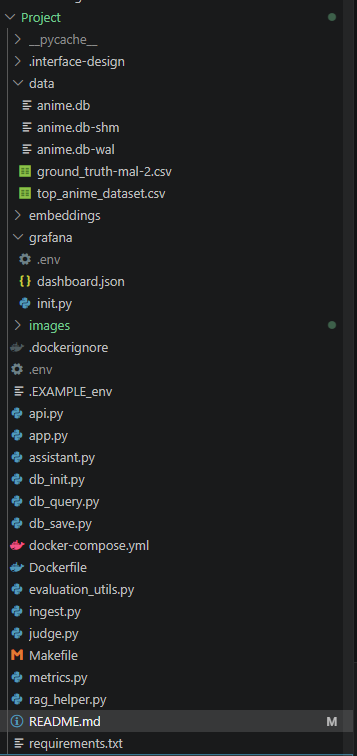

# Anime Recommendation Assistant

This project is an anime recommendation assistant powered by a retrieval-augmented generation (RAG) agent.

The Docker Compose setup starts:

- PostgreSQL for conversations and feedback
- A Flask API for the recommendation agent
- Streamlit for the user interface
- Grafana for monitoring conversations, feedback, cost, tokens, models, and response time



## Requirements

- Docker Desktop with Docker Compose
- An OpenAI API key

## 1. Configure the environment

Open a terminal in this directory:

```bash
cd Project
```

Copy the example environment file:

macOS/Linux:

```bash
cp .EXAMPLE_env .env
```

Windows PowerShell:

```powershell
Copy-Item .EXAMPLE_env .env
```

Open `.env` and replace `KeyHere` with your OpenAI API key.

Do not commit `.env` or share your API key.

## 2. Start the project

Build the application image and start all services:

```bash
docker compose up --build
```

The first startup may take a few minutes while Docker downloads images and installs Python dependencies.


## 3. Open the application

When the containers are running, open:

- Streamlit assistant: [http://localhost:8501](http://localhost:8501)
- Grafana: [http://localhost:3000](http://localhost:3000)

The default Grafana credentials are:

```text
Username: admin
Password: admin
```

If you changed the Grafana values in `.env`, use those values instead.


## 4. Ask a question

1. Open Streamlit at `http://localhost:8501`.
2. Enter an anime request, for example:

   ```text
   Recommend a fantasy anime with strong world-building and a clever main character.
   ```

3. Click **Ask**.
4. Review the answer and recommendations.
5. Select **+1** or **-1** to submit feedback.

Each request is saved in PostgreSQL. The agent also evaluates the answer and stores a judge relevance result.

## 5. View Grafana monitoring

Open Grafana at `http://localhost:3000` and open the **Fitness assistant** dashboard.

The dashboard is provisioned automatically and includes:

- Recent conversations
- User thumbs-up and thumbs-down feedback
- Judge relevance percentage
- LLM cost over time
- Prompt, completion, and total token usage
- Requests by model
- Response time


## Useful commands

Stop the services but keep the database and Grafana data:

```bash
docker compose down
```

Start the existing services again:

```bash
docker compose up
```

View service status:

```bash
docker compose ps
```

View API logs:

```bash
docker compose logs -f api
```

View all logs:

```bash
docker compose logs -f
```

## Reset local data

To remove the PostgreSQL and Grafana volumes and start from an empty installation:

```bash
docker compose down -v
docker compose up --build
```

This deletes local conversations, feedback, and Grafana configuration. Use it only when you want a clean reset.

## Troubleshooting

### The API cannot start

Check the API logs:

```bash
docker compose logs api
```

Make sure `.env` contains a valid `OPENAI_API_KEY` and the PostgreSQL settings are present.

### Streamlit says it cannot connect to the API

Check that the API is running and healthy:

```bash
docker compose ps
docker compose logs -f api
```

### Grafana is empty

Wait for the `grafana-init` service to finish, then refresh Grafana. You can inspect its logs with:

```bash
docker compose logs grafana-init
```

The dashboard will show more useful data after users ask questions and submit feedback.
