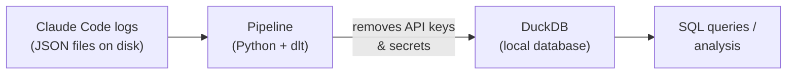

# Claude Logs → DuckDB Pipeline

A small data pipeline that collects the local logs Claude Code generates while I work (chat sessions, prompts, tool calls) and loads them into a queryable database. Built as a hands-on exercise in data engineering: extracting data from raw files, cleaning it, and loading it into a warehouse.

## What it does



1. **Extract** — reads every local log file Claude Code has written (one file per coding session).
2. **Clean** — automatically screens out and drops any line that looks like it contains an API key or password, so nothing sensitive ends up in the database.
3. **Load** — stores everything in [DuckDB](https://duckdb.org/), a lightweight database that lives in a single file, no server required.
4. **Re-runnable** — running it again only adds what's new, so it's safe to run as often as I like.

## Why

Every coding session with an AI assistant leaves a trail: what was asked, what was done, how long things took. Turning that into a database makes it possible to ask questions like "how many sessions did I have this month?" or "which projects am I spending the most time on?" — the same kind of thinking used to turn any messy raw data source into something a business can report on.

## Tools used

| Tool | Purpose |
|---|---|
| Python | Programming language |
| [dlt](https://dlthub.com/) | Open-source data-loading framework (the "pipeline" part) |
| DuckDB | Local database that stores the results |

## Result

| Table | Contents | Rows |
|---|---|---|
| `session_events` | Every message/action across all coding sessions | ~2,600 |
| `prompt_history` | Every prompt typed, across all projects | ~100 |

## Run it

```bash
uv run python claude_logs_pipeline.py
```

## View the data locally

dlt ships with a built-in dashboard. Run it from the command line, not from the agent session.

Make sure your pipeline ran successfully first:

```bash
uv run dlthub local show
```

This opens a marimo dashboard that reads from the local DuckDB file. You can browse the schema, see how many tables exist, look at the data in each table, and run SQL queries. This is where you validate that the pipeline loaded what you expected.

## Agent traces pipeline (REST API)

A second pipeline that pulls fake Claude Code agent logs from a [test REST API](https://test-agent-traces-api-xt2e7ottma-ew.a.run.app/docs) (`GET /logs`) and loads them into DuckDB the same way — raw JSON, no schema explosion.

```bash
uv run python rest_api_pipeline.py          # one page, 1000 records
uv run python rest_api_pipeline.py --full   # 20 pages, 20,000 records
```

Use the plain command for a quick smoke test, `--full` to load the full 20k-row sample used in the usage report below.

## Deploy the pipeline

Tell the agent to deploy the REST API pipeline:

```
deploy this on the dlthub platform, use duckdb as destination
```

The agent installs the `dlthub-platform` toolkit. It goes through a five-step checklist before deploying, then registers the pipeline in `__deployment__.py` and deploys it.

You can also do it manually:

```bash
uv run dlthub deploy   # ship the current project as a new version
uv run dlthub run      # run the pipeline on the cloud
```

Repeat this deploy-and-run cycle after every code change so the cloud always reflects your latest version.

## Claude Code usage report

A custom marimo notebook with charts about my own Claude Code usage (daily activity, prompts per day, busiest hours, event types, models used, projects, versions).

```bash
uv run marimo edit claude_logs_dashboard.py
```

Opens in the browser at `localhost:2718` (or the next free port).
